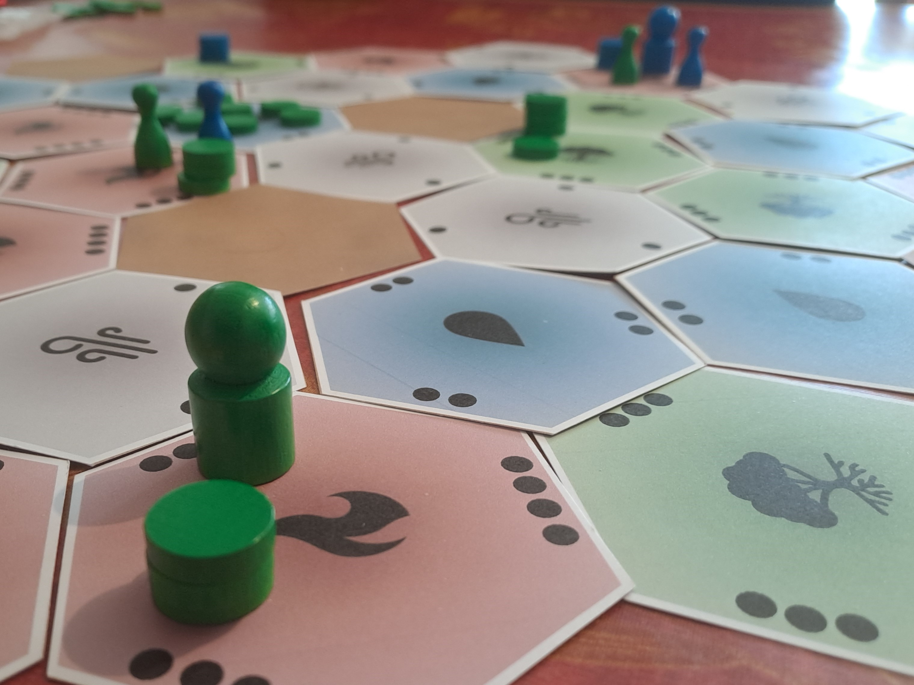
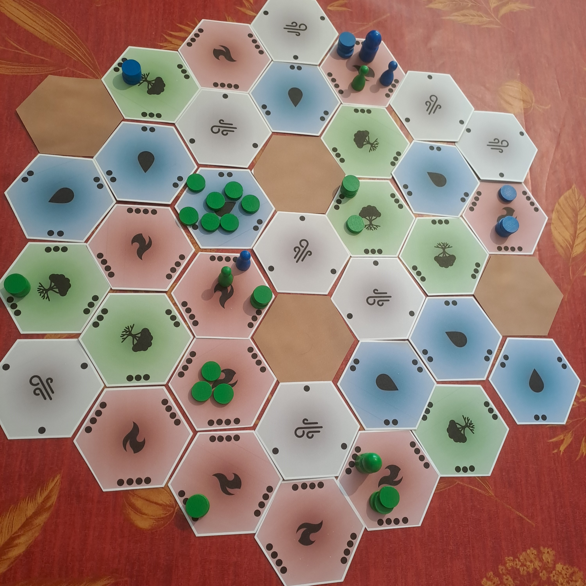

# Donjons et Barons: les règles du jeu
Le jeu « Donjons et Barons » est un jeu de plateau d’atmosphère féodale pour 2 à 4 joueurs incarnant des barons qui s’opposent dans la construction de donjons sur des territoires aux richesses variées. A chaque tour de jeu, un baron se déplace et ordonne des mouvements à ses troupes ou des opérations sur ses donjons, ou encore déplace ses saboteurs pour bloquer les ordres des barons adverses. Quel baron sera le plus riche avant tous les autres ?

 

Voir situations de jeu sur les photos ci-dessous. Voir les fichiers "Word" ou "PDF" pour le détail des règles.

Ce projet est en **phase de test et d'ajustement** à 2, 3 et 4 joueurs.

## Informations générales

Nombre de joueurs : 2 à 4 / Age minimum : 8 ans / Durée de partie : 1 heure

Type de jeu : tactique, stratégique, combo, conquête et combat

Rejouable grâce à un terrain mis en place aléatoirement / aléa du tour de jeu limité au bonus de déplacement ou de recrutement / deux façons de stopper et de gagner la partie / petite boîte de rangement 17 cm x 12.5 cm x 4 cm

Donjons et Barons, règles d'un jeu pour 2 à 4 joueurs.

Copyright (C) 2023 [lucas.borboleta@free.fr](mailto:lucas.borboleta@free.fr) ; licence Creative Commons BY-NC-SA

## Anecdote
La notion d'ordre de dispersion/concentration/recrutement est inspirée du jeu « [Realm](https://boardgamegeek.com/boardgame/3024/realm) » de Philip Orbanes. Le sabotage des communications est inspiré du « [Jeu de la Guerre](https://fr.wikipedia.org/wiki/Le_Jeu_de_la_guerre_(livre)) » de Guy Debord.

