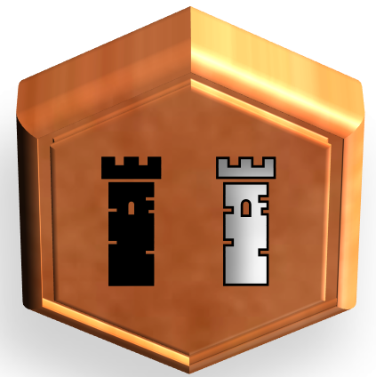

# Donjons et Rois : les règles du jeu
Le jeu « Donjons et Rois» est un jeu de plateau d’atmosphère féodale pour 2 à 4 joueurs incarnant des rois qui s’opposent dans la construction de donjons. A chaque tour de jeu, à coups multiples, un roi ordonne, au choix, la dispersion, la concentration,  le recrutement de ses troupes ou la construction de donjon.

Du jeu « Realm » de P. Orbanes (https://boardgamegeek.com/boardgame/3024/realm) est repris la notion d'ordre de dispersion/concentration/production, mais avec des réalisations complètement différentes.

Donjons et Rois, règles d'un jeu pour 2 à 4 joueurs.

Copyright (C) 2023 [lucas.borboleta@free.fr](mailto:lucas.borboleta@free.fr) ; licence Creative Commons BY-NC-SA

Voir les fichiers "Word" ou "PDF" pour le détail des règles. 

Ce projet est en cours de développement. Les mécaniques sont définies pour 2, 3 ou 4 joueurs. Par contre, leurs paramétrages et leurs tests sont à poursuivre.

Côté graphisme, il y a plusieurs types de tuiles hexagonales à dessiner:

- Les tuiles numérotées qui forment le paysage de base. Disposer de 2 ou 3 teintes aiderait visuellement.
- Les tuiles montagnes : elles sont infranchissables !
- Les tuiles objectifs : ces sont des endroits propices à la construction de donjons !

Le graphisme des cartes de mise en place doit attendre la finalisation du paramétrages des mécaniques.
