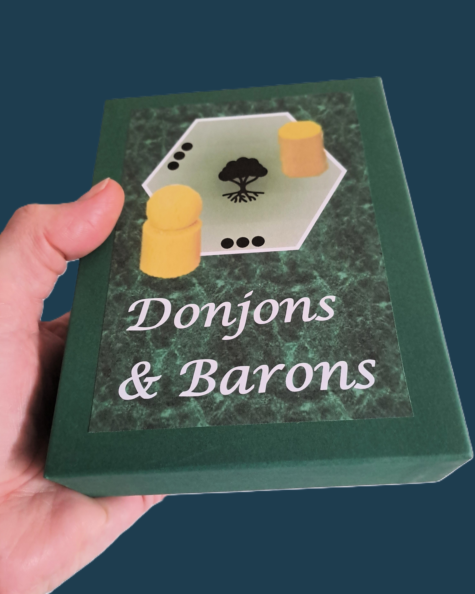
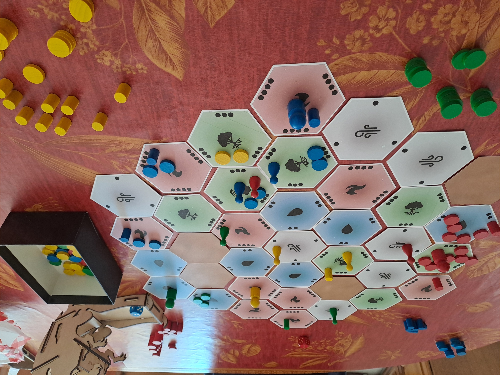
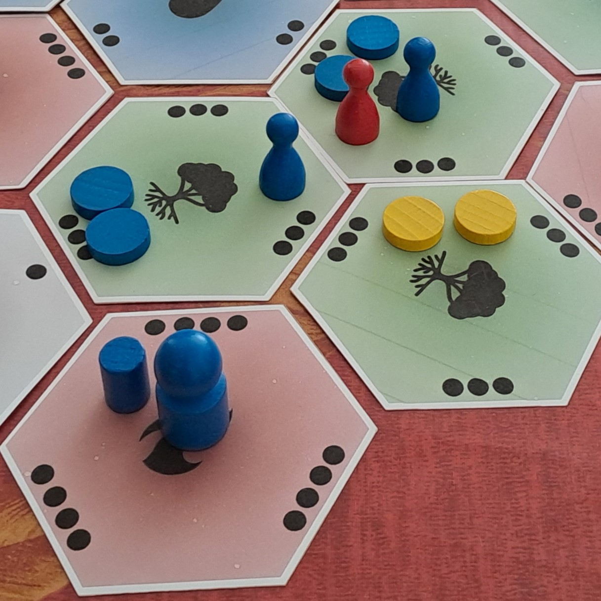

# Donjons et Barons : les règles du jeu
Le jeu « Donjons et Barons » est un jeu de plateau d’atmosphère féodale pour 2 à 4 joueurs incarnant des barons qui s’opposent dans la construction de donjons sur des territoires aux richesses variées. A chaque tour de jeu, un baron se déplace et ordonne des mouvements à ses troupes ou des opérations sur ses donjons, ou encore déplace ses saboteurs pour bloquer les ordres des barons adverses. Quel baron sera le plus riche avant tous les autres ?

Voir situations de jeu sur les photos ci-dessous. Voir les fichiers "[Word](./Donjons-et-Barons-les-regles.docx)" ou "[PDF](./Donjons-et-Barons-les-regles.pdf)" pour le détail des règles.

Ce projet est en phase de test et de paramétrage.

## Informations générales

Nombre de joueurs : 2 à 4 / Age minimum : 10 ans / Durée de partie : 45 à 90 minutes / Jeu expert

Type de jeu : tactique, stratégique, combo-conquête-combat

Petite boîte de rangement 17 cm x 12.5 cm x 4 cm / fabrication simple / deux façons de stopper et de gagner la partie / aléa du tour de jeu limité au bonus de déplacement ou de recrutement / combats sans aléa / terrain mis en place aléatoirement / tensions entre construction, attaque, course, blocage / plusieurs stratégies possibles / ambiance duel cérébral à 2 joueurs, mais aussi ambiance à rebondissements à 3 et 4 joueurs au gré des alliances éphémères

Donjons et Barons, règles d'un jeu pour 2 à 4 joueurs.

Copyright (C) 2023 [lucas.borboleta@free.fr](mailto:lucas.borboleta@free.fr) ; licence Creative Commons BY-NC-SA

## Anecdote
Le concept du choix d'un ordre de dispersion/concentration/recrutement depuis une tuile de commandement est inspiré du jeu « [Realm](https://boardgamegeek.com/boardgame/3024/realm) » (1974) de Philip Orbanes. Le concept de sabotage des communications avec le commandement est inspiré du « [Jeu de la Guerre](https://fr.wikipedia.org/wiki/Le_Jeu_de_la_guerre_(livre)) » (1965) de Guy Debord.

