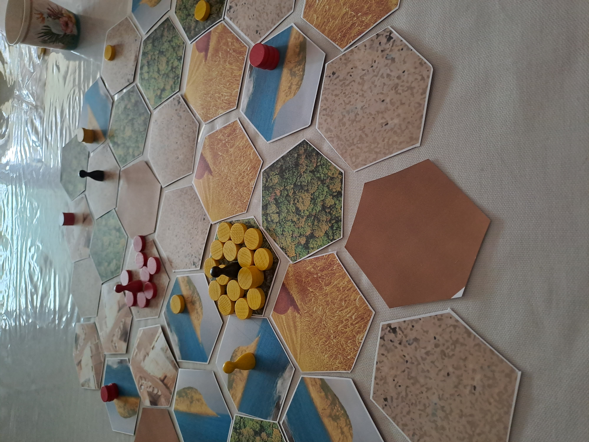

# Donjons et Barons: les règles du jeu
Le jeu « Donjons et Barons » est un jeu de plateau d’atmosphère féodale pour 2 à 4 joueurs incarnant des barons qui s’opposent dans la construction de donjons. A chaque tour de jeu, à coups multiples, un baron ordonne, au choix, un mouvement de troupes ou une opération sur un donjon. Gare aux saboteurs qui bloque la transmission des ordres !

La notion d'ordre de dispersion/concentration/production est inspirée du jeu « [Realm](https://boardgamegeek.com/boardgame/3024/realm) » de Philip Orbanes. Le sabotage des communications est inspiré du « [Jeu de la Guerre](https://fr.wikipedia.org/wiki/Le_Jeu_de_la_guerre_(livre)) » de Guy Debord.

Donjons et Barons, règles d'un jeu pour 2 à 4 joueurs.

Copyright (C) 2023 [lucas.borboleta@free.fr](mailto:lucas.borboleta@free.fr) ; licence Creative Commons BY-NC-SA

Voir les fichiers "Word" ou "PDF" pour le détail des règles. 

Ce projet est en cours de développement. Les mécaniques sont globalement définies pour 2, 3 ou 4 joueurs. Les ajustements et leurs tests sont en cours.

