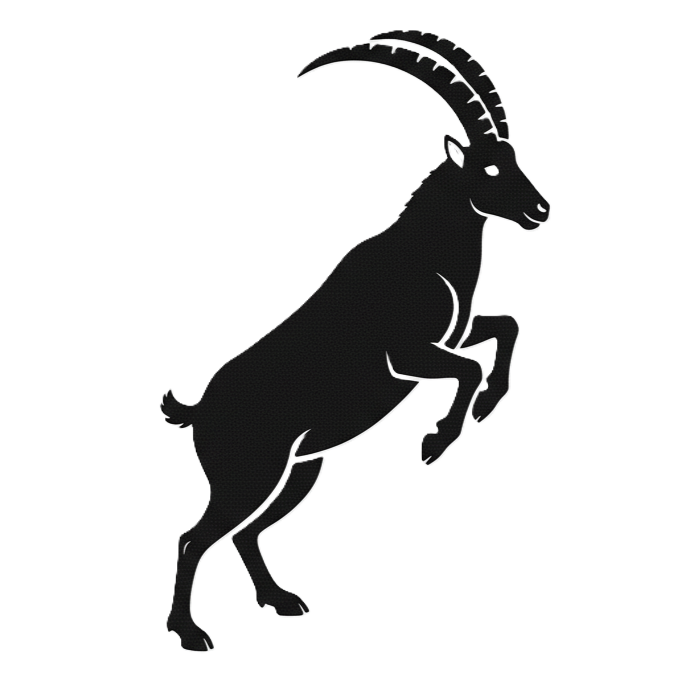

# NOMS

Recherche de noms alternatifs pour le jeu actuellement nommé "Donjons et Barons".

- Terre de Barons ; en anglais, "Land of Barons"

  

Autres aspects thématiques associés :

- Remplacer "Donjon" par "Tour", ou même par "Château".
- Remplacer les "éléments" décoratifs des tuiles par des armoiries médiévales simples.

   
