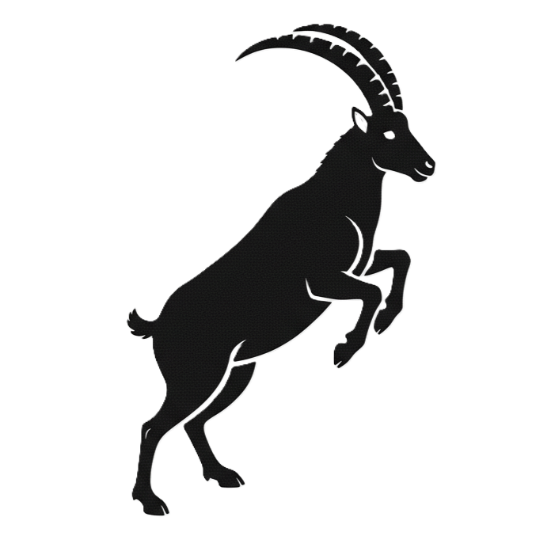
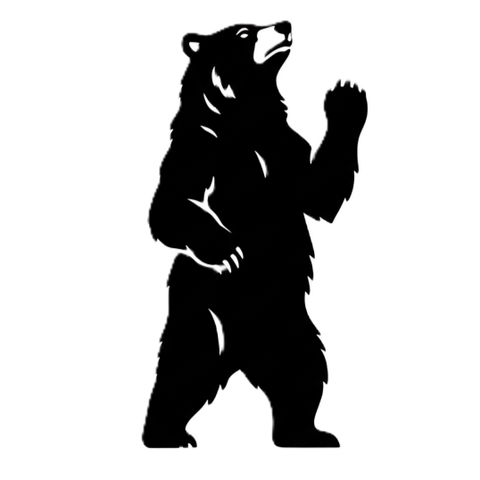

# THEMES

Voici des idées de thèmes alternatifs pour "Donjons & Barons".

Pourquoi ? Parce que "envoyer des troupes au combat" peut être perçu comme "trop guerrier" par certaines personnes.

Thème de la marine à voile:

- Tuile = Zone maritime
- Montagne = Mer rugissante
- Donjon = Base navale ou bien arsenal où les navires transporteurs sont construits
- Troupe = Transporteur
- Baron = Navire amiral
- Chevalier = Frégate

Thème SF dans l'espace interstellaire :

- Tuile = Système stellaire
- Montagne = Trou noir
- Donjon = Base stellaire où les vaisseaux transporteurs sont construits
- Troupe = Transporteur
- Baron = Croiseur amiral
- Chevalier = Intercepteur

Thème féodal japonais (bon avec retour des troupes):

* Baron = Daïmio
* Chevalier = Samouraï
* Donjon = Château
* Montagne = Montagne
* Troupe = Troupe
* Tuile = Domaine ou Terre

# NOM DU JEU

Recherche de noms alternatifs pour le jeu actuellement nommé "Donjons et Barons".

- Terre de Barons ; en anglais, "Land of Barons"

  

# ARTEFACTS

Autres aspects thématiques associés :

- Remplacer "Donjon" par "Tour", ou même par "Château".
- Remplacer les "éléments" décoratifs des tuiles par des armoiries médiévales simples.

    
